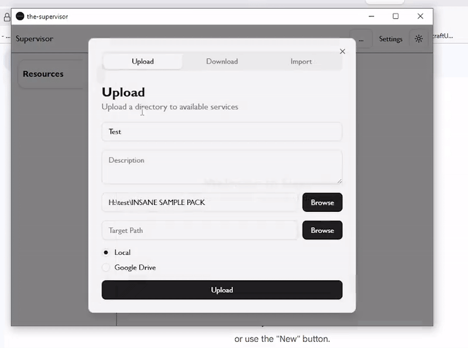

# 👁️ The Supervisor

IM The Supervisor, can i get the taxi numbhaaa?
DANCE WITH ME AH, COME ON COME ONE.
DANCE WITH ME AAAH, COME ON COME ON.

---

## ✨ Features

* **Uploading:** Upload to google drive or move stuff to a different directory.
* **Downloading:** Download files from a google drive.
* **Drag & Drop:** Move audio files directly to your DAW.
* **Manifest Files:** Link to remote drives using manifest files.



---

## 🛠️ Google Cloud Setup

To enable the google drive features, you must configure a project in the [Google Cloud Console](https://console.cloud.google.com/).

### 1. Create OAuth Credentials
1. **Create a Project:** Name it `The Supervisor`.
2. **Enable APIs:** Go to **Enabled APIs & Services**, click **+ ENABLE APIS AND SERVICES**, and search for **Drive API**. Enable it.
3. **Credentials:**
   * Navigate to **API & Services** > **Credentials** > **Create Credentials** > **OAuth client ID**.
   * Set **Application type** to `Desktop app`.
   * Name it `Supervisor-Desktop`.
   * Copy your `Client ID` and `Client Secret`.
   * Set those in your `Settings` page in the application
4. Authorize and get your google api tokens.

> **CRITICAL SECURITY NOTE:** DO NOT SHARE your Client ID or Client Secret with anyone!!!!

### 2. Activating Test Users (Important)
No need to publish the application just run it in test mode.
1. Navigate to **API & Services** > **OAuth Concent Screen** > **Audience**.
1. Scroll down to **Test users**.
2. Click **+ ADD USERS**.
3. Enter your Gmail address and any other accounts you want to primarily use for this application.
4. Click **Save**.

---

## 🚀 Getting Started

### Prerequisites
* Node.js (LTS version)
* npm or yarn

### Installation
1. Clone the repository:
   ```bash
   git clone [https://github.com/Batman4496/the-supervisor.git](https://github.com/Batman4496/the-supervisor.git)
   cd the-supervisor